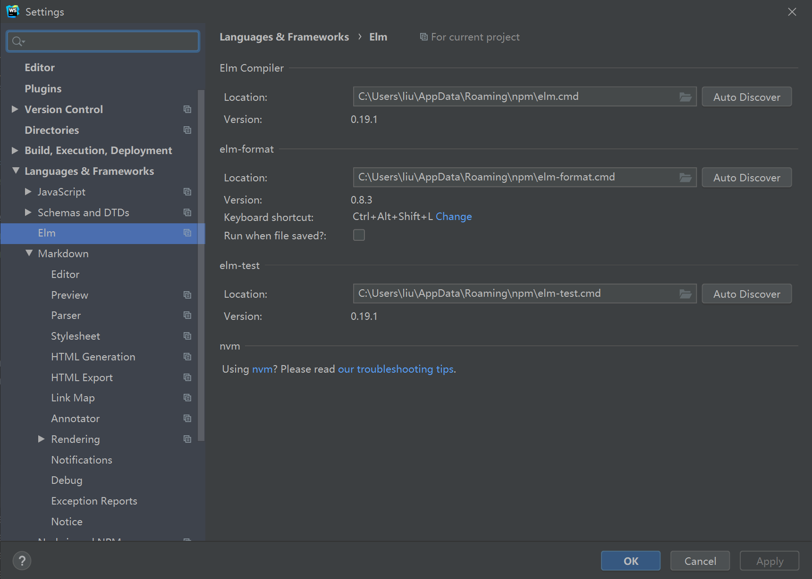

# Elm Installation

According to the [Official Guide](https://guide.elm-lang.org/install/elm.html), you can install `elm` by downloading the installer and run them directly. However, it's not convenient to manage different versions of `elm`.

In modern web development, `nodejs` is usually used to build projects. `elm` can also be installed vis `npm` (node package manager), which is shipped along with `nodejs`.

This tutorial will first introduce the installation of `nodejs` on different operating systems, and then the installation of  `elm` with `npm`.

## Nodejs Installation

If you don't know what's a package manager (such as `apt`, `pacman`, `brew`, `choco`), you can download The `nodejs` installer from [nodejs.org](https://nodejs.org/en/download/). You'd better choose the LTS (Long Term Support) version, which is more stable than others. Then you can skip this section, the rest are all about how to install `nodejs` with package managers.

If you are using a package manager , or are going to use one (**recommended**), follow this [guide](https://nodejs.org/en/download/package-manager/). We also list the commands in some major operating systems.

### NVM (All WSL / Linux / macOS)

[nvm](https://github.com/nvm-sh/nvm) is the node version manager, you can install it with

```bash
curl -o- https://raw.githubusercontent.com/nvm-sh/nvm/v0.35.3/install.sh | bash
```

This script will install `nvm` for you, and append some lines to your `.bashrc` or `.zshrc` file.

**Restart the shell**, and then you can install `nodejs` v12 with
```bash
nvm install 12
```

If you can't use `nvm`, you can use your `rc` file whether something like these lines exist in the end. If not, please ass them.

```bash
export NVM_DIR="$HOME/.nvm"
[ -s "$NVM_DIR/nvm.sh" ] && \. "$NVM_DIR/nvm.sh"  # This loads nvm
[ -s "$NVM_DIR/bash_completion" ] && \. "$NVM_DIR/bash_completion"  # This loads nvm bash_completion
```

### WSL (Windows Subsystem for Linux) or Linux Debian / Ubuntu

```bash
$ sudo apt update
$ sudo apt install nodejs npm
```

### Arch Linux / Manjaro

```bash
$ sudo pacman -Syyu nodejs npm
```

### macOS

```bash
$ brew install node
```

## Install Elm with npm

After you have installed `nodejs`, open the terminal and type

```bash
$ node --version
$ npm --version
```

If your installation is successful, these commands should output the version of `nodejs` and `npm`. The recommended versions are `nodejs>=12.x.x` and `npm>=5.x.x`.

If either of the command failed, there should be some problem with your environment. This rarely happen on Linux and macOS. On Windows, the default installation path should be `C:\Program Files\nodejs\`, make sure this path is already in your environment variable `Path`.

In China, the connection to `npm` official registry may be very slow, you can set the registry to taobao by

```bash
$ npm config set registry https://registry.npm.taobao.org
```

Then you can use `npm` to install these packages

```bash
$ npm install -g elm elm-format elm-test
```

If you have permission errors, use
```bash
$ sudo npm install -g elm elm-format elm-test --unsafe-perm
```

The binaries are downloaded from GitHub. If you failed to install the packages, try the [SJTU VPN](https://net.sjtu.edu.cn/wlfw/VPN.htm).

## IDE Configuration

You can use any IDE you want to develop `elm` projects. Here we will recommend some of useful ones.

### JetBrains WebStorm

You can install the [Elm plugin](https://plugins.jetbrains.com/plugin/10268-elm) in WebStorm. There will be a `Elm` block in Settings (or Preferences on macOS), you need to configure the path of `elm`, `elm-format` and `elm-test` installed by `npm`.

After everything is configured, there will be a popup (or notice) about selecting the `elm.json` file. Note that you may need to run `elm make` before selecting `elm.json` if there exist dependencies that are not installed on your computer.

#### Windows Issues

Note that on Windows, you need to install `nodejs` and `elm` directly on Windows, not in WSL. You can use [Chocolatey](https://chocolatey.org/) as a package manager on Windows.

```powershell
choco install -y nodejs-lts
```

If you don't have `choco`, download the installer and install it directly.

If the auto detection failed on Windows, please ensure that `C:\Users\liu\AppData\Roaming\npm` is already in your environment variable `Path`, or you can select the files manually as shown in the example below.




### VSCode

Search for `elmtooling.elm-ls-vscode` in the plugins.

The author is `Elm tooling`.

### Sublime Text

### Atom


