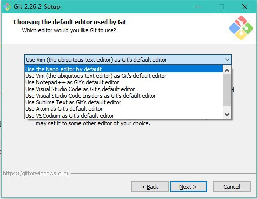

# Working with git and Redmine

## 1. git installation

If everything downloads slowly....try using SJTU VPN or use your agent(if you have one)

###  Windows

Download git from [Git - Downloads](git-scm.com/downloads)

1. Choose installation location

2. Keep the default options

3. Choose a text editor (like VSC, Sublime Text, vim) so that when Git detects some problems with your code, it will open your code in this editor. 

   - You need to install the text editor before you choose it here

   - Personal Recommendation: Visual Studio Code, as i am using it)

   

4. Choose the second one

5. Choose the first one

6. Choose the first one. This is important if your teammates are using macOS or Linux.

7. First

8. Default

   

After install, if git bash launches successfully, then it is done.

### macOS

Using [homebrew](https://brew.sh/)

If `brew` is not installed in your mac yet, follow the guide on the homebrew website.

Open the terminal.

~~~bash
brew install git
~~~
Type `git --version` after installation, if it returns a version number, then it is done.

### Linux

Reference in https://www.git-scm.com/download/linux

~~~bash
sudo apt-get install git
~~~
Type `git --version` after installation, if it returns a version number, then it is done.

## 2. Setting git

First, open a terminal (Windows please right click to start `git bash`)

Then run these two commands with your own username and own email adddress.

~~~bash
git config --global user.name "your_username"
git config --global user.email "email@example.com"
~~~

What is the username and email?

- If you have worked out some code, then in the log of this git repository (code project), it will show like:

- We recommend you to sign up for a [Github](github.com) account and use your [Github](github.com) account in your config

## 3. Installing a Git GUI (optional)

Using Git through applications that has a user interface! (It works the same as typing commands in the terminal)

Recommendation

- [Sourcetree](https://www.sourcetreeapp.com/) (Windows, Mac)
- [Github Desktop](https://desktop.github.com/) (Windows, Mac)

## 4. How to use git?

### Git clone

I will cover one command for this tutorial, `git clone`.

If you want to get a copy of an existing Git repository (repo for short)— for example, a project you’d like to contribute to — the command you need is `git clone`.

An example: https://github.com/JI-git-workshop/KttSoup

1. Copy the link below `Clone or download`
2. Choose a folder to place your cloned repo. 
3. Type in your terminal (hey, Windows right click again!)

~~~
git clone https://github.com/JI-git-workshop/KttSoup.git
~~~

4. Then `cd kttSoup`. There should be a `README.md`, with the same content.

### Explore Git more yourself

[Learn Git branch](https://learngitbranching.js.org/)

[Git book](https://git-scm.com/book/en/v2/Git-Basics-Getting-a-Git-Repository)

## 4. Redmine

Redmine is on http://focs.ji.sjtu.edu.cn:2143/.

### Register

1. Click the `Sign in` button on the top right corner.
2. Click `Login in with jAccount`. It is the only way to register

### Some demo

After you log in, click `Projects` on the top left corner.

There are two public projects as Redmine examples.

- `Ketchup Tomato Tomato Soup`: It is the issue tracker for setting up Redmine, used within me, Li and Yihao
- `Silver Legendary Lobster`: The issue tracker for writing docs on the VG100 website. This passage you are reading has one issue in this project.

