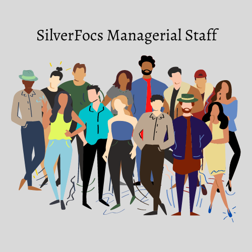

# "We foster talents, encourage creativity, and reward excellence"

SilverFocs incubator was founded in 2000 as a special branch of the FOCS company. Back in 2002, we released our first game, Creed of Knight, which grows into one of the most popular games through out the world. Over the past 20 years, SilverFocs has reached 10 thousand excellent games with over 100 million world-wide players.

## Our best practices

We always treat player experience as our first concern. The feedbacks from players are crucial to our improvement. We want to achieve the excellence of game by interacting, communicating and engaging with our players.

We work together as an incubator for amazing gamedev teams working on their future games.  We value creativity and quality, while constantly striving for excellence. We hold that our teams, peers and players can stand together to contribute to infinite possibility of SilverFocs

## Aimed at innovation
One of the most common questions SilverFocs representatives are asked is “How do you manage to create so many unique experiences?”. And the answer is simple:

All developers at SilverFocs are fresh to the field rookies. Unconstrained by convention, they come up with the most exceptionally innovative ideas. With careful guidance of our managerial staff and encouragement from our Innovation Director, these ideas are able to prosper and flourish into their best selves in our games.

## Our management team

## Get to know abour your managers below!

### Kazato Shozo, the Field Manager
<table>
<th width="180"> 

</th>
<th align="left">
<u>Responsibility:</u> To ensure the entrusted field is productive and expanding timely. 
<u>Previous notable projects:</u>
<ul>
<li> "Skyville"(Project Manager)</li>
<li> "Awe and Fear"(Field Manager) </li>
<li> "Competitors of Trophy Hunting"(Group Manager)</li>
<li> "Nero Sun" (Sound Designer)</li>
</ul>
Is known to give brief comprehensive feedback.
</th>
</table>

### Josie Mendoza, the District Manager 
<table>
<th width="180"> 

</th>
<th align="left"> 
<u>Responsibility:</u> To ensure the section of the company is keeping up with set schedule and not straying from field policy. 
<u>Previous notable projects:</u>
<ul>
<li> "Wildlife Tales"(Accretion Manager)</li> 
<li> "Cyberscape" (District Manager)</li> 
<li> "Antirage"(Developer)</li> 
</ul>
<u>Awards:</u> Outstanding District Manager(two last years in a row)
 
 
Is known to point out the most important issues in her feedback.
</th>
</table>

### Mikel Leblanc, the Group Manager
<table>
<th width="180"> 

</th>
<th align="left"> 
<u>Responsibility:</u> To manage and oversee the work of active project teams. Ensure, they are working on schedule and producing quality work. 
<u>Previous notable projects:</u> 
<ul>
<li> "Runeforce"(Developer)</li> 
<li> "Awe and Fear"(Group Manager)</li> 
<li> "Death and Fire: Throne Angels"(Group Manager)</li> 
</ul>
<u>Awards:</u> GameDevHeroes(Leadership Hero) 
<u>Previously worked at:</u> The Gatherer Softworks(Project Manager) 
 
Is known for spoting many issues, even if they are hiding in the tiniest of details. 
</th>
</table>

### Long Zhou, the Technical Production Manager
<table>
<th width="180"> 

</th>
<th align="left"> 
<u>Responsibilities:</u> To ensure the work done is not harmful to the 
company's long term ambitions. For example, the code is written well 
enough to support long term maintenance, the games can be run on 
required specs, while using their full potential. 
<u>Previous notable projects:</u> 
<ul>
<li> "No Pc Unfried: The Game"(Lead Engine 
developer)</li> 
<li> "Spellborn War" (Solo Developer),</li> 
</ul>
<u>Awards:</u> DevelopAwards(Engine for "No PC Unfried" Engine)
<u>Previously worked at:</u> The Gatherer Softworks(Lead Engine developer)  
Is known for his exceptional technical feedback. 
</th>
</table>

### Joe Cherry, the Innovation Director
<table>
<th width="180"> 

</th>
<th align="left"> 
<u>Responsibilities:</u> To find and foster innovative ideas within the company and to encourage unique thinking on all levels. 
<u>Previous notable projects:</u> 
<ul>
<li> "Evoway"(Solo Designer)</li> 
<li> "GreenBall and His Friends"(Lead Developer)</li> 
<li> "Undercover Tale"(Lead Developer)</li> 
</ul>
<u>Awards:</u> 
<ul>
<li>  Game Developers Choice Awards(Innovation Award) as Lead 
Designer</li> 
<li>  GameDevHeroes(Unsung Hero)</li> 
</ul>
<u>Previously worked at:</u> GreenSkyGames(Co-Founder and Lead Designer)  
<u>Warning:</u> is known to be eccentric and overenthusiastic at times.
</th>
</table>

### Vonda Holder, the Preemptive Brand Manager
<table>
<th width="180"> 

</th>
<th align="left"> 
<u>Responsibilities:</u> To protect the brand image by checking intellectual property being produced at the company for possible breaches of copyright, for inappropriate topics and general adherence to brand and company image. 
<u>Previous notable projects:</u> 
<ul>
<li>  "Death and Fire: Throne Angels"(Lead Designer) </li> 
<li>  "Antirage"(Visual Designer)</li> 
<li>  "Rainbow History"(Risk aversion manager)</li> 
</ul>
Is known as the go-to authority for complicated copyright questions and other risk assessments.  
<u>Warning:</u> does not pull any punches.
</th>
</table>

### Ines Scott, SilverFocs CTO
<table>
<th width="180"> 

</th>
<th align="left"> 
<u>Responsibility:</u> Making executive decisions on behalf of the company's technological requirements,managing technology budgets and time frames, ensuring all technology practices adhere to regulatory standards.  
<u>Warning:</u> as a CTO of the whole company, shall only be contacted if it is needed.
</th>
</table>

### Donnell Benitez, SilverFocs CEO
<table>
<th width="180"> 

</th>
<th align="left"> 
<u>Responsibility:</u> Make high-level decisions about policy and strategy, develop and implement operational policies and a strategic plan, oversee the company’s fiscal activity, including budgeting, reporting, and auditing.  
<u>Warning:</u> as a CEO of the whole company, shall only be contacted if it is needed.
</th>
</table>

## License

MIT License

Copyright (c) 2020 UM-SJTU-JI VG100 Team

